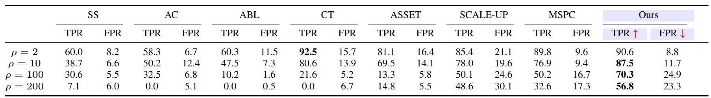
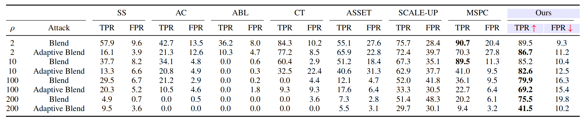

Table1: Performance comparison of RPP against WaNet backdoor attack with SoTA defense methods on 4 kinds of imbalanced CIFAR-10 datasets ($\mu=0.9$, $\rho$ = 2, 10, 100, 200).

Table2: Comparison with SoTA defense methods against Blend and Adaptive Blend backdoor attack with  blending ratio of 0.2 on 4 kinds of imbalanced CIFAR-10 datasets ($\mu = 0.9$, $\rho = 2, 10, 100, 200$).
